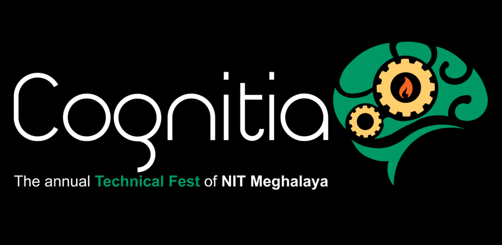

 <h1 align=center>Cognitia 2018</h1>

**Cognitia** is the annual technical festival of **National Institute of Technology , Meghalaya**.
Cognitia literally meaning the **'I think therefore I am'** is a celebration of the creative spirit and youthful energy inherent in the college students.

This is the repository for the **official app of Cognitia 2018**

[**Download :** ](https://play.google.com/store/apps/details?id=in.cognitia.cognitia18 "Cognitia 2018 | App on Play Store")

[-ff69b4.svg)](https://play.google.com/store/apps/details?id=in.cognitia.cognitia18 "Cognitia 2018 | App on Play Store")

## Features
The app includes the following features:

* Information about various events happening during Cognitia. The events are divided into three broad categories:
  * **Technical:** Robotics events
  * **Departmental:** Events from the five departments: CSE, Civil, EE, ECE and Mechanical, of NIT Mrghalaya.
  * **Other events:** Various other events like Gaming, E-Cell, Arpeggio(The singing night) and Shimmer(The competition for mr. and mrs fresher).
  
* Details of members of various teams.
* Sechedule of the events.
* Registrationm forms of different events.
* A navigation drawer that facilitates navigating through the app.
* Links to other social media accounts of Cognitia
 
## Development
 The app makes use of the following technologies:
 
 * App makes use of the new and improved `AndroidX` libraries in place of the `Support Libraries`
 * Uses `Android App Bundles` that helps in reducing APK size on Play Store by dynamically generating APKs as per the device
 * Firebase Realtime Database
 * Firebase UI (Uses Firebase Recycler Adapter)
 * Glide (for loading images)
 * Firebase Cloud Messaging (FCM)
 * Lottie (for displaying animations in intro slider)
 * And many others..., some of which are mentioned below.
 
## Thanks
 
 A big thanks goes to the developers of the following libraries. The app wouldn't have been possible:
 
 * [CrescentoImageView](https://github.com/developer-shivam/Crescento "CrescentoImageView") by Shivam Satija
 * [TapTargetView](https://github.com/KeepSafe/TapTargetView "TaptargetView") by KeepSafe
 * [Glide](https://github.com/bumptech/glide "Glide") by Bump Technoloigies
 * [Lottie for Android](https://github.com/airbnb/lottie-android "Lottie for Android") by Airbnb
 * [VerticalViewPager](https://github.com/castorflex/VerticalViewPager "VerticalViewPager") by Antoine Merle
 * [Android-Gif-Drawable](https://github.com/koral--/android-gif-drawable "Android-Gif-Drawable") by Karol Wrótniak
